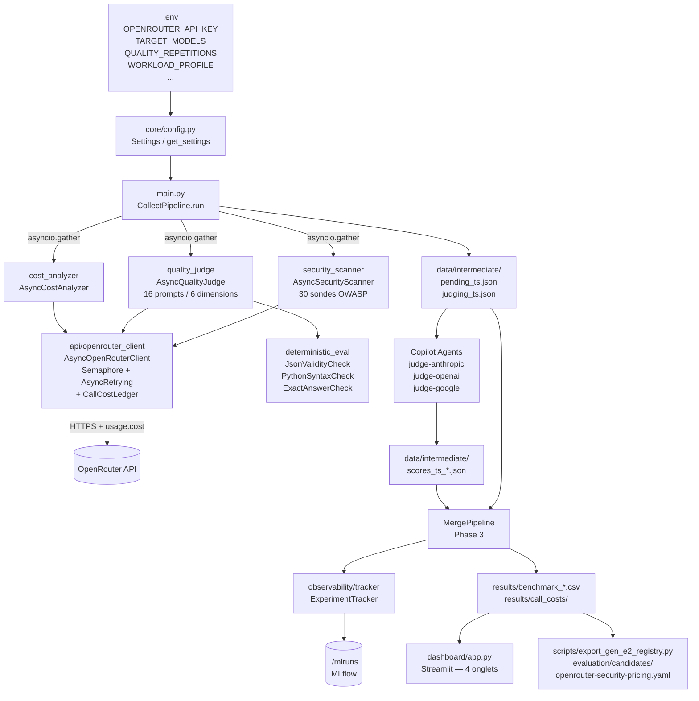

# ADR 0001 — Architecture Initiale du Pipeline d'Évaluation LLM

**Statut :** Accepté
**Date :** 2026-07-10
**Décideurs :** @enzo.turquet (Palo IT Singapore)
**Ticket :** Initial architecture — llm-model-screening

---

## Contexte

Palo IT Singapore a besoin d'un outil reproductible pour comparer les modèles de
langage disponibles sur l'agrégateur OpenRouter selon trois axes : qualité des
réponses, coût par token, et robustesse face aux attaques par injection de prompt.

L'évaluation doit être :
- **Stateless** — exécutable en CI/CD ou sur un conteneur AWS sans état persistant
- **Scalable** — capable de tester 10+ modèles × 50+ prompts sans attendre des heures
- **Auditables** — résultats versionnés, reproductibles, traçables (pas juste un CSV)

---

## Décision

### Stack Python 3.11+ avec architecture Clean et modules séparés par axe d'évaluation.

```
src/core/        → configuration (pydantic-settings)
src/api/         → client HTTP (openai SDK + httpx)
src/evaluators/  → un module par axe (coût, qualité, sécurité)
src/observability/ → tracking MLflow
dashboard/       → Streamlit (visualisation Pareto)
```

---

## Décisions techniques clés

### D1 — OpenAI SDK plutôt que `requests` brut

**Nous avons décidé d'** utiliser le SDK `openai` (pointé sur OpenRouter via
`base_url`) plutôt qu'un client HTTP custom.

**Raison :** OpenRouter est nativement compatible avec l'API OpenAI. Le SDK gère
déjà la sérialisation, les types, et expose une interface `AsyncOpenAI` pour le
mode async V2 — évite de réimplémenter ce qui existe.

### D2 — `tenacity` pour les retries

**Nous avons décidé d'** utiliser `tenacity` (décorateur `@retry` / contexte
`AsyncRetrying`) plutôt qu'une boucle `while` manuelle.

**Raison :** Gère nativement l'exponential back-off, le jitter, les conditions de
retry configurables (HTTP 429, 500, timeout), et le logging avant chaque tentative.
En mode async, `AsyncRetrying` libère le Semaphore pendant l'attente.

### D3 — `asyncio.Semaphore` pour le rate-limiting (V2)

**Nous avons décidé d'** utiliser `asyncio.Semaphore(max_concurrent_requests)`
plutôt qu'une file de type producer/consumer.

**Raison :** Implémentation simple, configurable par variable d'environnement,
et compatible avec le pattern `async with semaphore:` à l'intérieur de chaque
tentative de retry — ce qui libère le slot pendant les back-off.

### D4 — LLM-as-a-Judge avec mitigations de biais

**Nous avons décidé d'** utiliser un modèle maître (GPT-4o par défaut) comme juge
avec deux mitigations obligatoires :
1. **Position bias** : ordre des réponses randomisé → aliases anonymes (A, B, C…)
2. **Verbosity bias** : rubrique explicite dans le prompt système interdisant de
   favoriser les réponses plus longues

**V2 — Chain-of-Thought :** Le juge doit produire un raisonnement de 3-5 phrases
AVANT d'attribuer une note (champ `reasoning` validé par Pydantic avant `score`).

### D5 — Pré-évaluation déterministe avant le juge LLM (V2)

**Nous avons décidé d'** exécuter des vérifications en pur code (JSON validity,
Python syntax) avant d'appeler le modèle juge.

**Raison :** Si la réponse est détectable comme correcte ou incorrecte par du code
(ex. `json.loads()` réussit ou échoue), on évite un appel API → économie directe.

### D6 — MLflow local plutôt que W&B ou Langfuse (V2)

**Nous avons décidé d'** utiliser MLflow avec `MLFLOW_TRACKING_URI=./mlruns`
(tracking local par défaut).

**Raison :** Aucune dépendance à un service externe, pas de compte requis, déjà
dans l'écosystème Palo IT. Les logs sont limités aux métriques (tokens, latence,
coût) — jamais le contenu des prompts (SEC-001).

### D8 — OWASP LLM Top 10 comme cadre de référence sécurité

**Nous avons décidé d'** structurer les sondes de sécurité selon les 10 catégories
OWASP LLM Top 10 (2025) plutôt qu'une liste ad hoc de jailbreaks.

**Raison :** L'OWASP offre un vocabulaire commun et un classement reconnu par
criticité enterprise. Structurer les sondes par catégorie permet de produire un
`RobustnessSafetyIndex` pondéré (LLM01 = 25%, LLM02 = 20%, autres = 2–5%)
et un heatmap lisible par un client non-technique.

### D9 — Suite de qualité versionnée et validée à l'entrée

**Nous avons décidé d'** valider le fichier de prompts contre un schéma Pydantic
(`QualityPrompt`) qui exige des références objectives (réponses acceptées,
JSON attendu, contrat de fonction) ou des critères de jugement explicites pour
les prompts ouverts.

**Raison :** Un prompt sans contrat objectif et sans critères de jugement produit
un score non reproductible. Le `quality_suite_id` (hash du fichier) lie chaque
résultat à une version exacte de la suite pour une comparaison temporelle fiable.

### D10 — Macro-moyenne par dimension pour le score qualité

**Nous avons décidé d'** calculer `avg_quality_score` comme moyenne des scores
de dimension, et non comme moyenne plate de tous les prompts.

**Raison :** Une dimension avec 10 prompts faciles (JSON) ne doit pas dominer
une dimension avec 2 prompts de communication complexe. Le macro-average par
dimension préserve l'équilibre sans imposer des poids arbitraires par prompt.

### D11 — Coût réel par appel via `response.usage.cost`

**Nous avons décidé de** capturer le champ `usage.cost` renvoyé par OpenRouter
dans chaque complétion et de le persister dans un `CallCostRecord` distinct
du TCO prévisionnel.

**Raison :** Pour les modèles gratuits, `tco_usd = 0` masque toute information
de coût. La colonne `actual_cost_credits` avec `actual_cost_coverage_rate`
permet de distinguer « zéro réel » de « donnée absente », évitant une
fausse certitude sur le caractère gratuit d'un modèle.

### D12 — CER conditionné à la couverture de la suite qualité

**Nous avons décidé de** ne calculer le CER (qualité/TCO) que si
`quality_coverage_rate ≥ 0.8` **et** `quality_dimension_coverage_rate = 1.0`.

**Raison :** Un CER calculé sur un score partiel (15 prompts sur 16,
ou 4 dimensions sur 6) serait comparé incorrectement avec un CER complet.
Bloquer le CER force à interpréter séparément la qualité et le coût quand
l'évidence est insuffisante.



---

## Alternatives envisagées

| Alternative | Raison du rejet |
|---|---|
| `requests` brut pour les appels LLM | Réimplémentation du retry, sérialisation, types — déjà dans le SDK |
| `asyncpg` / base de données | Trop lourd pour un pipeline stateless ; MLflow suffit pour le tracking |
| Weights & Biases | Compte externe requis, plus lourd à configurer pour un POC |
| Langfuse | Moins universel que MLflow dans un contexte enterprise Palo IT existant |
| `concurrent.futures.ThreadPoolExecutor` | `asyncio` natif + meilleure intégration avec le SDK openai async |
| Score 0 pour les échecs déterministes | Incompatible avec la contrainte Pydantic `ge=1` ; score=1 (pire) utilisé à la place |
| Moyenne plate des scores qualité | Masque les lacunes par dimension ; macro-moyenne par dimension retenue |
| CER sur TCO uniquement | Ne distingue pas coût nul réel de coût indisponible ; `actual_cost_credits` ajouté |

---

## Conséquences

**Positives :**
- Runtime du benchmark ≈ modèle le plus lent (pas la somme de tous)
- Coût réduit grâce à la pré-évaluation déterministe
- Résultats traçables et comparables dans le temps via MLflow et `quality_suite_id`
- Dashboard décisionnel prêt à montrer à un client (4 onglets)
- Export direct vers gen-e2-eval

**Négatives / compromis :**
- `asyncio` complexifie le débogage (stack traces moins lisibles)
- MLflow local ne scale pas au-delà de l'utilisation mono-machine
- Le juge LLM reste subjectif malgré les mitigations — marge ~10-15%
- La suite qualité générique ne remplace pas une évaluation métier

**Neutres :**
- Les évaluateurs sync (V1) sont conservés pour la compatibilité avec les tests

---

## Références

- [OpenRouter API docs](https://openrouter.ai/docs)
- [OpenRouter Usage Accounting](https://openrouter.ai/docs/use-cases/usage-accounting)
- [tenacity — AsyncRetrying](https://tenacity.readthedocs.io/)
- [MLflow Tracking](https://mlflow.org/docs/latest/tracking.html)
- [OWASP LLM Top 10 (2025)](https://owasp.org/www-project-top-10-for-large-language-model-applications/) —
  édition de référence originale pour `owasp_probes.json` et les poids RSI. Le projet OWASP a depuis publié
  l'[OWASP GenAI LLM Top 10 2026](https://genai.owasp.org/resource/owasp-genai-llm-top-10-2026/)
  (catégories/rangs canoniques : [GenAI-Security-Project/GenAI-LLM-Top10](https://github.com/GenAI-Security-Project/GenAI-LLM-Top10)) ;
  `owasp_probes.json` et `_RSI_WEIGHTS` ont été mis à jour vers cette édition le 2026-08-21. Les poids RSI
  restent une pondération interne (non publiée par OWASP) — méthodologie documentée dans
  `security_scanner.py`.
- [LLM-as-a-Judge (Zheng et al., 2023)](https://arxiv.org/abs/2306.05685)
- `docs/plans/feature-security-cost-specialization-1.md` — plan d'implémentation V3

## Alternatives envisagées

| Alternative | Raison du rejet |
|---|---|
| <!-- Option A --> | <!-- pourquoi écarté --> |
| <!-- Option B --> | <!-- pourquoi écarté --> |

---

## Références

- <!-- lien doc, RFC, PR, ADR précédent -->
