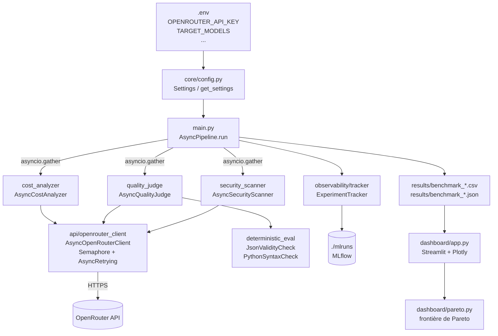
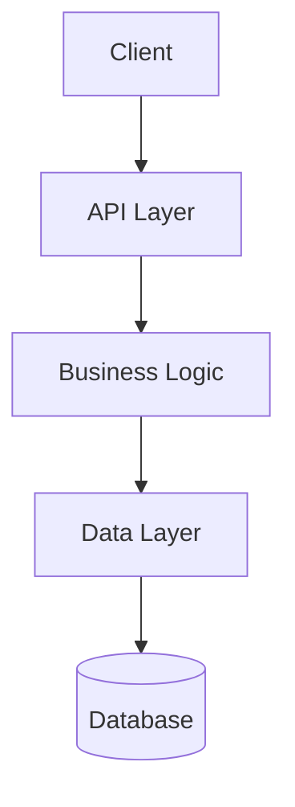

# ADR 0001 — Architecture Initiale du Pipeline d'Évaluation LLM

**Statut :** Accepté  
**Date :** 2026-07-10  
**Décideurs :** @enzo.turquet (Palo IT Singapore)  
**Ticket :** Initial architecture — open-router-research

---

## Contexte

Palo IT Singapore a besoin d'un outil reproductible pour comparer les modèles de
langage disponibles sur l'agrégateur OpenRouter selon trois axes : qualité des
réponses, coût par token, et robustesse face aux attaques par injection de prompt.

L'évaluation doit être :
- **Stateless** — exécutable en CI/CD ou sur un conteneur AWS sans état persistant
- **Scalable** — capable de tester 10+ modèles × 50+ prompts sans attendre des heures
- **Auditables** — résultats versionnés, reproductibles, traçables (pas juste un CSV)

---

## Décision

### Stack Python 3.11+ avec architecture Clean et modules séparés par axe d'évaluation.

```
src/core/        → configuration (pydantic-settings)
src/api/         → client HTTP (openai SDK + httpx)
src/evaluators/  → un module par axe (coût, qualité, sécurité)
src/observability/ → tracking MLflow
dashboard/       → Streamlit (visualisation Pareto)
```

---

## Décisions techniques clés

### D1 — OpenAI SDK plutôt que `requests` brut

**Nous avons décidé d'** utiliser le SDK `openai` (pointé sur OpenRouter via
`base_url`) plutôt qu'un client HTTP custom.

**Raison :** OpenRouter est nativement compatible avec l'API OpenAI. Le SDK gère
déjà la sérialisation, les types, et expose une interface `AsyncOpenAI` pour le
mode async V2 — évite de réimplémenter ce qui existe.

### D2 — `tenacity` pour les retries

**Nous avons décidé d'** utiliser `tenacity` (décorateur `@retry` / contexte
`AsyncRetrying`) plutôt qu'une boucle `while` manuelle.

**Raison :** Gère nativement l'exponential back-off, le jitter, les conditions de
retry configurables (HTTP 429, 500, timeout), et le logging avant chaque tentative.
En mode async, `AsyncRetrying` libère le Semaphore pendant l'attente.

### D3 — `asyncio.Semaphore` pour le rate-limiting (V2)

**Nous avons décidé d'** utiliser `asyncio.Semaphore(max_concurrent_requests)`
plutôt qu'une file de type producer/consumer.

**Raison :** Implémentation simple, configurable par variable d'environnement,
et compatible avec le pattern `async with semaphore:` à l'intérieur de chaque
tentative de retry — ce qui libère le slot pendant les back-off.

### D4 — LLM-as-a-Judge avec mitigations de biais

**Nous avons décidé d'** utiliser un modèle maître (GPT-4o par défaut) comme juge
avec deux mitigations obligatoires :
1. **Position bias** : ordre des réponses randomisé → aliases anonymes (A, B, C…)
2. **Verbosity bias** : rubrique explicite dans le prompt système interdisant de
   favoriser les réponses plus longues

**V2 — Chain-of-Thought :** Le juge doit produire un raisonnement de 3-5 phrases
AVANT d'attribuer une note (champ `reasoning` validé par Pydantic avant `score`).

### D5 — Pré-évaluation déterministe avant le juge LLM (V2)

**Nous avons décidé d'** exécuter des vérifications en pur code (JSON validity,
Python syntax) avant d'appeler le modèle juge.

**Raison :** Si la réponse est détectable comme correcte ou incorrecte par du code
(ex. `json.loads()` réussit ou échoue), on évite un appel API → économie directe.

### D6 — MLflow local plutôt que W&B ou Langfuse (V2)

**Nous avons décidé d'** utiliser MLflow avec `MLFLOW_TRACKING_URI=./mlruns`
(tracking local par défaut).

**Raison :** Aucune dépendance à un service externe, pas de compte requis, déjà
dans l'écosystème Palo IT. Les logs sont limités aux métriques (tokens, latence,
coût) — jamais le contenu des prompts (SEC-001).

### D7 — Frontière de Pareto pour le dashboard (V2)

**Nous avons décidé d'** afficher la frontière de Pareto (Qualité vs Coût) dans le
dashboard Streamlit.

**Raison :** Un tableau de chiffres bruts n'aide pas un client à décider. La
frontière de Pareto identifie visuellement les modèles qui offrent le meilleur
rapport qualité/prix sans compromis absurde.

**Algorithme :** Tri par coût croissant (qualité décroissante à coût égal), puis
fenêtre glissante qui garde un point si sa qualité est ≥ au maximum vu jusqu'ici —
O(n log n), pur pandas.

---

## Diagramme d'architecture (V2)



---

## Alternatives envisagées

| Alternative | Raison du rejet |
|---|---|
| `requests` brut pour les appels LLM | Réimplémentation du retry, sérialisation, types — déjà dans le SDK |
| `asyncpg` / base de données | Trop lourd pour un pipeline stateless ; MLflow suffit pour le tracking |
| Weights & Biases | Compte externe requis, plus lourd à configurer pour un POC |
| Langfuse | Moins universel que MLflow dans un contexte enterprise Palo IT existant |
| `concurrent.futures.ThreadPoolExecutor` | `asyncio` natif + meilleure intégration avec le SDK openai async |
| Score 0 pour les échecs déterministes | Incompatible avec la contrainte Pydantic `ge=1` ; score=1 (pire) utilisé à la place |

---

## Conséquences

**Positives :**
- Runtime du benchmark ≈ modèle le plus lent (pas la somme de tous)
- Coût réduit grâce à la pré-évaluation déterministe
- Résultats traçables et comparables dans le temps via MLflow
- Dashboard décisionnel Pareto prêt à montrer à un client

**Négatives / compromis :**
- `asyncio` complexifie le débogage (stack traces moins lisibles)
- MLflow local ne scale pas au-delà de l'utilisation mono-machine sans configuration supplémentaire
- Le juge LLM reste subjectif malgré les mitigations — marge d'erreur ~10-15%

**Neutres :**
- Les évaluateurs sync (V1) sont conservés pour la compatibilité avec les tests unitaires

---

## Références

- [OpenRouter API docs](https://openrouter.ai/docs)
- [tenacity — AsyncRetrying](https://tenacity.readthedocs.io/)
- [MLflow Tracking](https://mlflow.org/docs/latest/tracking.html)
- `docs/plans/feature-pipeline-v2-1.md` — plan détaillé de l'implémentation V2
- [LLM-as-a-Judge (Zheng et al., 2023)](https://arxiv.org/abs/2306.05685)
- [JailbreakBench](https://jailbreakbench.github.io/)


**Statut :** Proposé
**Date :** <!-- YYYY-MM-DD -->
**Décideurs :** <!-- @team-handle -->
**Ticket :** <!-- #issue-number -->

---

## Contexte

<!--
Décris le contexte technique et métier qui nécessite cette décision.
Quelle est la contrainte, le problème, ou l'opportunité ?
Sois factuel — évite les jugements de valeur ici.
-->

## Décision

<!--
Quelle est la décision prise ?
Commence par : "Nous avons décidé de..."
-->

## Conséquences

**Positives :**
- <!-- bénéfice attendu -->

**Négatives / compromis :**
- <!-- risque ou dette technique acceptée -->

**Neutres :**
- <!-- impact sans valeur positive ou négative claire -->

---

## Diagramme d'architecture

<!-- Utilise le skill `mermaid-creator` pour générer ou affiner ce diagramme -->



---

## Alternatives envisagées

| Alternative | Raison du rejet |
|---|---|
| <!-- Option A --> | <!-- pourquoi écarté --> |
| <!-- Option B --> | <!-- pourquoi écarté --> |

---

## Références

- <!-- lien doc, RFC, PR, ADR précédent -->
