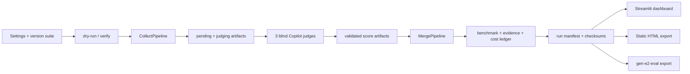

# Plan d'amélioration du projet

## 1. Diagnostic

Le projet dispose déjà d'une architecture utile et cohérente : collecte
asynchrone OpenRouter, pré-évaluation déterministe, jugement aveugle en trois
agents, fusion des résultats, ledger de coûts et deux surfaces de dashboard.
L'amélioration prioritaire est donc la fiabilité de la chaîne de livraison et
la traçabilité des runs, plutôt que l'ajout immédiat d'un nouvel évaluateur.

Les constats qui motivent ce plan sont les suivants :

- `.github/workflows/ci.yml` rend les jobs TypeScript non bloquants avec
  `npm run lint || true`, `npm run type-check || true` et `npm test || true`.
- La CI exécute les tests Python, mais ne publie pas de couverture et n'impose
  aucun seuil ; le projet possède pourtant déjà `pytest-cov` et `make test-cov`.
- `src/main.py` concentre les transitions entre collect, jugement et merge.
  Ces transitions sont critiques car `make collect` peut engager des coûts
  OpenRouter, tandis que `make merge` dépend de fichiers intermédiaires et de
  contrats JSON exacts.
- Les résultats sont timestampés et riches, mais la validation d'un run
  complet, sa provenance et son nettoyage opérationnel peuvent être rendus
  plus explicites.
- Le dashboard live et l'export statique partagent déjà `dashboard/data_prep.py`,
  ce qui fournit une bonne frontière pour continuer à éviter les divergences.

## 2. Objectifs et hors périmètre

### Objectifs

1. Faire échouer la CI lorsqu'une vérification annoncée échoue.
2. Protéger les contrats entre les trois phases et les sorties exportées.
3. Augmenter la couverture des chemins d'orchestration et des erreurs sans
   appeler OpenRouter en CI.
4. Rendre chaque benchmark comparable, identifiable et récupérable.
5. Préserver la séparation entre données brutes, preuves dérivées et rendu HTML.

### Hors périmètre pour cette itération

- Remplacer OpenRouter, MLflow, Streamlit ou le mécanisme de jugement Copilot.
- Transformer ce pré-screening en benchmark métier ; ce rôle reste celui de
  `gen-e2-eval`.
- Ajouter de nouveaux modèles, probes ou dimensions qualité avant d'avoir
  stabilisé les contrats et la validation.

## 3. Priorités

| Priorité | Chantier | Valeur | Risque traité |
|---|---|---|---|
| P0 | CI réellement bloquante | Immédiate | Régressions fusionnées silencieusement |
| P0 | Contrats de run et tests d'orchestration | Élevée | Résultats incomplets ou fusion incorrecte après dépense API |
| P1 | Reproductibilité et provenance | Élevée | Comparaisons impossibles ou non auditables |
| P1 | Observabilité et exploitation | Moyenne à élevée | Diagnostic lent, stockage difficile à gérer |
| P2 | Expérience dashboard et packaging | Moyenne | Usage manuel, divergence ou installation fragile |

## 4. Architecture cible



Le contrat cible est un manifeste immuable par run, associé au timestamp :

```text
run_id
quality_suite_id
security_probe_set_id
target_models
workload_profile
quality_repetitions
pipeline_version
created_at
artifacts[]: {path, kind, sha256, bytes}
validation: {preflight, collection, judges, merge}
```

Le manifeste ne contient ni clé API ni prompt/réponse supplémentaire. Il
référence les artefacts existants et permet de vérifier qu'ils correspondent
bien au même run.

## 5. Découpage d'implémentation

### Phase 1 — Rendre la CI bloquante

**Fichiers concernés :** `.github/workflows/ci.yml`, `Makefile`,
`package-lock.json` si nécessaire, éventuellement `pyproject.toml`.

1. Supprimer les `|| true` des étapes TypeScript et faire échouer
   explicitement l'installation si `package-lock.json` est absent ou décider
   d'un chemin documenté unique.
2. Ajouter `npm ci` puis `npm run lint`, `npm run type-check` et `npm test` comme
   étapes obligatoires.
3. Ajouter une étape Python `pytest --cov=src --cov-report=term-missing` avec un
   seuil initial documenté et réaliste, puis l'augmenter après la phase 2.
4. Réutiliser les mêmes commandes que `make lint`, `make type-check`,
   `make test-cov` et `make docs-build` afin d'éviter un comportement différent
   entre le poste local et GitHub Actions.
5. Ajouter un job ou une matrice minimale pour Python 3.11 et 3.13 si les
   dépendances et la durée le permettent.

**Validation :** provoquer localement une erreur lint et vérifier que la CI
échoue ; exécuter `make lint`, `make type-check`, `make test-cov` et
`make docs-build` avec des dépendances propres.

### Phase 2 — Sécuriser les contrats des trois phases

**Fichiers concernés :** `src/main.py`,
`src/evaluators/quality_judge.py`, `src/evaluators/security_scanner.py`,
`.github/agents/judge-coordinator.agent.md`, `tests/test_main.py`,
`tests/test_quality_judge.py`, `tests/test_security_scanner.py`.

1. Extraire ou formaliser les schémas des artefacts `pending`, `judging` et
   `scores` avec Pydantic ou des validateurs purs, sans exposer les secrets.
2. Valider en entrée de `MergePipeline` : timestamp identique, alias map
   complète, couverture exacte `(prompt_id, attempt, alias)`, suite qualité,
   modèles et mode de sécurité cohérents.
3. Rendre les erreurs actionnables : distinguer fichier absent, JSON invalide,
   mauvais run, couverture juge incomplète et données incompatibles.
4. Ajouter des tests d'intégration légers de `CollectPipeline.run`,
   `MergePipeline.run`, `DryRunPipeline.run` et du dispatch CLI avec
   `AsyncMock`/`FakeAsyncOpenRouterClient` ; aucun appel réseau réel.
5. Tester explicitement les scénarios dangereux : reprise sur artefact déjà
   présent, juge manquant, juge du mauvais timestamp, modèle inconnu et budget
   d'erreurs dépassé.

**Validation :** `pytest tests/test_main.py tests/test_quality_judge.py
tests/test_security_scanner.py -q`, puis un `make dry-run` complet et un test
de merge sur fixtures valides et invalides.

### Phase 3 — Ajouter la reproductibilité et la provenance

**Fichiers concernés :** `src/main.py`, `src/core/config.py`,
`src/evaluators/quality_judge.py`, `src/evaluators/security_scanner.py`,
`src/observability/tracker.py`, `scripts/`, `tests/`, `docs/workflow.md`.

1. Calculer des identifiants stables pour la suite qualité, le jeu de probes,
   le profil de charge et la configuration non secrète du run.
2. Écrire un manifeste de run après chaque phase, avec les chemins relatifs,
   tailles et SHA-256 des artefacts finalisés.
3. Enregistrer dans MLflow les identifiants de provenance, les versions de
   suite et les compteurs de validation, jamais les prompts, réponses, probes
   sensibles ou secrets.
4. Ajouter une commande de diagnostic gratuite, par exemple `make inspect-run`,
   qui vérifie un manifeste et explique les artefacts manquants ou modifiés.
5. Documenter la politique de rétention, la reprise d'un run interrompu et la
   distinction entre résultat brut et preuve dérivée.

**Validation :** deux dry-runs identiques produisent les mêmes identifiants de
   suite et de configuration ; une modification d'un artefact est détectée par
   `inspect-run` ; les tests vérifient l'absence de `OPENROUTER_API_KEY` dans
   le manifeste et les paramètres MLflow.

### Phase 4 — Renforcer l'observabilité opérationnelle

**Fichiers concernés :** `src/observability/tracker.py`, `src/main.py`,
`src/api/openrouter_client.py`, `dashboard/data_prep.py`, tests associés,
`docs/workflow.md`.

1. Ajouter des événements structurés par phase et par modèle : début, succès,
   retry, échec technique, budget interrompu et export.
2. Exposer des compteurs agrégés de retries, erreurs HTTP, timeouts, latence
   réseau et couverture des coûts, sans enregistrer le contenu des échanges.
3. Unifier les identifiants de corrélation entre logs, ledger de coûts,
   résultats et MLflow.
4. Ajouter un résumé de diagnostic dans l'export HTML : statut du run, qualité
   des données, couverture et avertissements, séparé des scores métier.
5. Définir des tests de non-régression pour les métriques existantes, en
   particulier les latences capturées après acquisition du sémaphore.

**Validation :** dry-run lisible dans les logs ; test vérifiant qu'un retry est
   compté sans doubler le coût ; export HTML valide et échappé avec un texte
   non fiable.

### Phase 5 — Améliorer l'exploitation et le packaging

**Fichiers concernés :** `dashboard/app.py`, `dashboard/data_prep.py`,
`dashboard/glossary.py`, `scripts/export_dashboard_html.py`, `pyproject.toml`,
`README.md`, `docs/`.

1. Introduire une sélection explicite de run dans le dashboard et l'export,
   au lieu de dépendre uniquement du fichier le plus récent.
2. Afficher l'état de provenance et les limites de comparabilité avant les
   classements : suite, probes, répétitions, couverture et profil TCO.
3. Continuer à maintenir les transformations dans `dashboard/data_prep.py` et
   couvrir les vues live et statiques avec les mêmes fixtures.
4. Vérifier le packaging d'installation : décider si `dashboard/` et les
   scripts sont distribués, ou documenter clairement qu'ils sont utilisés
   depuis la racine du dépôt.
5. Ajouter une validation CI de l'export statique sur un fixture minimal,
   incluant XSS, données absentes, run legacy et colonnes inconnues.

**Validation :** `make export-html` sur fixture ; vérification visuelle ou
snapshot HTML du statut de provenance ; `make docs-build` strict ; installation
dans un environnement vierge suivie de `make dry-run`.

## 6. Critères d'acceptation globaux

- Une erreur de lint, typage, test ou documentation rend la CI rouge.
- Un merge ne peut pas combiner des artefacts provenant de runs différents.
- Chaque résultat exporté possède un manifeste et des identifiants de suite,
  probes et configuration.
- Les tests couvrent les transitions normales et les échecs des phases sans
  réseau réel ni dépense OpenRouter.
- Les artefacts bruts restent inchangés ; les vérifications et diagnostics sont
  stockés à côté d'eux.
- Aucun prompt, réponse, probe sensible ou secret n'est ajouté aux métadonnées
  MLflow ou au manifeste.
- Les dashboards live et statiques affichent les mêmes dérivations et signalent
  les limites de couverture et de comparabilité.

## 7. Ordre recommandé et dépendances

L'ordre recommandé est **Phase 1 → Phase 2 → Phase 3 → Phase 4 → Phase 5**.
La Phase 1 peut commencer immédiatement. La Phase 2 doit précéder la création
du manifeste, car celui-ci doit décrire des contrats de phase déjà validés. La
Phase 4 peut démarrer en parallèle de la Phase 3 après stabilisation des
identifiants. La Phase 5 dépend uniquement des contrats et fixtures de la
Phase 2.

## 8. Risques et décisions à prendre

- **Seuil de couverture :** commencer par un seuil qui ne bloque pas les
  changements locaux en cours, le mesurer sur la branche courante, puis le
  relever par paliers ; ne pas masquer une baisse avec `|| true`.
- **Version de pipeline :** choisir une convention simple, par exemple la
  version du package ou un identifiant git, tout en conservant la compatibilité
  avec les runs historiques.
- **Rétention :** définir combien de fichiers `data/intermediate/`,
  `results/quality_details/` et `results/call_costs/` sont conservés localement
  avant d'automatiser le nettoyage.
- **Compatibilité legacy :** les anciens résultats restent lisibles ; un
  manifeste synthétique ou un statut `legacy` doit être utilisé lorsqu'une
  information n'existait pas au moment du run.

## 9. Première tranche livrable

La première livraison devrait contenir uniquement la Phase 1 et le début de la
Phase 2 : CI bloquante, couverture mesurée, validation stricte des artefacts de
merge et tests d'intégration de `CollectPipeline`/`MergePipeline`. Elle produit
un gain de confiance immédiatement vérifiable et fournit les fixtures
nécessaires aux phases de provenance et de dashboard.

## 10. Avancement

- [x] CI stricte : installation Python/npm, lint, typage et tests échouent sur
   une erreur réelle.
- [x] Seuil de couverture Python initial fixé à 80 % ; niveau observé après la
   tranche : 81,31 %.
- [x] Tests d'orchestration existants conservés et complétés par la validation
   du contrat minimal des artefacts `pending` avant merge.
- [x] Manifeste de provenance après merge, contrôles SHA-256 et commande
   `make inspect-run`.
- [x] Paramètres de provenance non sensibles corrélés au run MLflow.
- [x] Événements JSON structurés de début/fin pour les phases `collect` et
   `merge`, sans contenu de prompts ou de réponses.
- [x] Sélection explicite d'un run déjà disponible dans le dashboard et résumé
   des anomalies déjà disponible dans l'export HTML.
